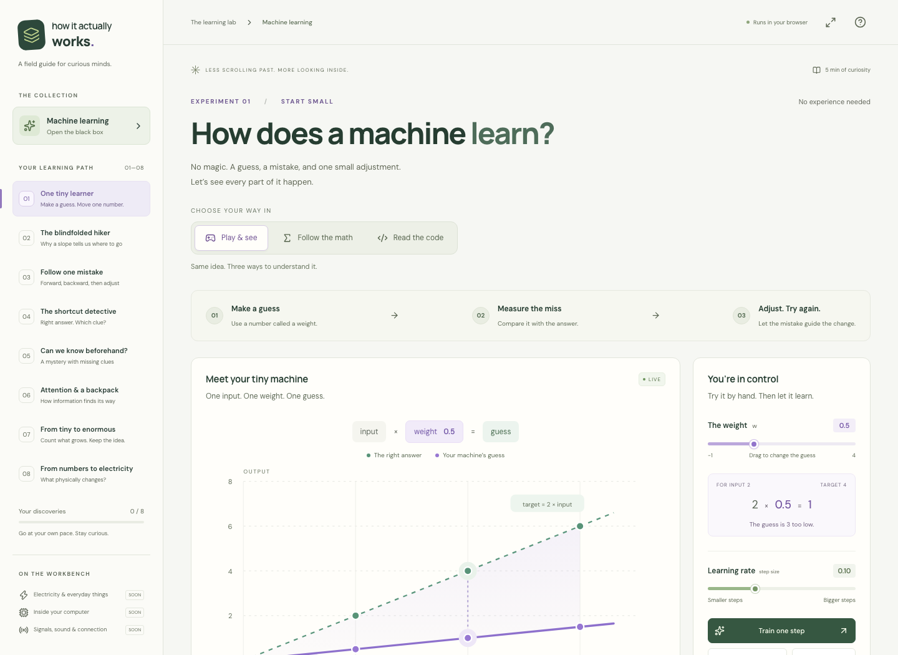

# How it actually works

A hands-on field guide for the question behind the explanation: **“But what is actually happening?”**

The first collection opens up machine learning. Move a weight, guide a blindfolded hiker, follow one mistake backward through a network, and watch an updated number become a new pattern of bits. Each idea starts with a small game or visible action, then connects to its calculation and real code.



This repository is also the foundation for a future YouTube channel. The **eight machine-learning chapters below are implemented now**. Full collections about electricity, computer memory, semiconductors, sound, and everyday devices will follow; the final chapter gives a first bridge into hardware.

## Run the learning lab

Install **Node.js 24 LTS** and a version of `make`, then run this from the repository folder:

```sh
make run
```

Open **[http://127.0.0.1:5173](http://127.0.0.1:5173)**. If that port is already in use, stop the other server or use `npm run dev -- --port 5174`. Stop the server with `Ctrl+C`.

The first run installs the locked npm dependencies and needs internet access. Subsequent runs work locally with those dependencies installed. The application requires **no backend, account, API key, GPU, or Python installation**. Training happens in your browser. Only completed-chapter progress is stored in `localStorage`; experiments reset when you leave their chapter. External research links need an internet connection.

If you use `nvm`, the included `.nvmrc` selects the recommended Node version with `nvm use`. Without `make`, use:

```sh
npm ci
npm run dev
```

## Three ways into the same idea

Every chapter offers these modes:

| Mode                | What you do                                                                                            |
| ------------------- | ------------------------------------------------------------------------------------------------------ |
| **Play & see**      | Make a prediction, step through a picture or animation, and change something to test your explanation. |
| **Follow the math** | Inspect the numbers, derivatives, assumptions, and update rules behind the mechanism.                  |
| **Read the code**   | Walk through highlighted source lines, copy the code, and run a small implementation yourself.         |

Begin with **Play & see**. Pause after one change and explain it in your own words before opening the equations. The guided stories introduce one mechanism at a time; the network and shortcut chapters also have optional free labs for more experiments.

## Eight discoveries, one learning path

| Chapter                            | Your experiment                                                         | What becomes visible                                                                                 |
| ---------------------------------- | ----------------------------------------------------------------------- | ---------------------------------------------------------------------------------------------------- |
| **1. One tiny learner**            | Drag one weight, predict its next move, and train one step.             | A prediction, a mistake score, a gradient, and an exact update.                                      |
| **2. The blindfolded hiker**       | Feel a local slope, choose a step size, and try other search rules.     | Why gradient descent can help, why it can fail, and what alternatives trade off.                     |
| **3. Follow one mistake**          | Send values forward, trace a derivative backward, and move the weights. | Activations, the chain rule, backpropagation, and simultaneous updates.                              |
| **4. The shortcut detective**      | Keep the shape fixed and change its background.                         | Correct answers can depend on a clue that stops working when the world changes.                      |
| **5. Can we know beforehand?**     | Guess a hidden rule, reveal two possible worlds, and add a clue.        | What data cannot identify, alongside exact forecasts and conditional bounds.                         |
| **6. Attention & a backpack**      | Let word cards exchange messages; carry a number past distractions.     | Attention arithmetic, selective memory, and their connection to Transformer and Mamba architectures. |
| **7. From tiny to enormous**       | Follow architecture schematics and count dense-network parameters.      | How connectivity and storage grow, and why a count does not predict quality.                         |
| **8. From numbers to electricity** | Toggle stored bits and step through memory → arithmetic → memory.       | How a program changes a physically represented weight, including rounding.                           |

The chapters work on a phone or desktop, with keyboard controls and reduced-motion styles. Use the presentation control in the top bar for demonstrations. **Field notes & sources** opens references and a print/save-as-PDF option. Your browser handles PDF generation.

## Your first calculation

In chapter 1, the examples are `1 → 2`, `2 → 4`, and `3 → 6`. The machine computes `guess = weight × input`.

Starting with weight `0.5`, its guesses are `0.5, 1, 1.5`. The loss is half the mean squared error:

```text
errors   = −1.5, −3, −4.5
loss     = (2.25 + 9 + 20.25) / 6 = 5.25
gradient = ((−1.5 × 1) + (−3 × 2) + (−4.5 × 3)) / 3 = −7
new w    = 0.5 − 0.1 × (−7) = 1.2
new loss ≈ 1.49333
```

Press **Train one step**, then select **Follow the math** to inspect those numbers. The examples supply the correct outputs; the update rule uses their errors to change the multiplier. The displayed training results come from actual calculations.

Chapter 3 then guides you through one small ReLU network. Its optional free lab trains a separate two-input network with `tanh` hidden units, a sigmoid output, and handwritten backpropagation. Both implementations expose the arithmetic directly; no machine-learning library performs it for you.

## Run the code on its own

Run every standalone example:

```sh
make examples
```

Or run the complete XOR learner directly, without installing the website's dependencies:

```sh
node examples/neural-network.mjs
```

It initializes 17 parameters, computes predictions, differentiates the loss, updates every parameter, and prints the measured result. All four binary inputs are training examples, so its result demonstrates fitting XOR. The other programs cover a single weight, gradient descent, one backpropagation step, shortcut learning, exact forecasts, attention, selective state, and parameter counts.

See [the code walkthrough and example index](docs/code-examples.md). These are ordinary JavaScript programs using arrays, numbers, and `Math`, with no ML package imports.

## What this lab can—and cannot—tell you

We can calculate every update in these small models. Some objectives even let us derive the entire training trajectory before running it. That differs from guaranteeing an arbitrary architecture's future accuracy from its dataset alone.

Different rules can match every observed example and disagree on a new one. A performance claim needs assumptions about the data, candidate models, and future inputs; a measured score covers the evaluation that produced it. More computing power does not supply a missing observation. Knowing the update equations also does not automatically give every learned feature a human-readable meaning.

The free network lab's separate “unseen” examples never provide training gradients. **Because you can inspect their scores while choosing settings, they function as a validation set, not a final independent test.** With wrong training labels enabled, that validation set remains clean.

The simplifications are explicit: the shortcut classifier receives two numerical features instead of pixels; the attention and memory games demonstrate ingredients rather than complete trained Transformer or Mamba models; and the eight-bit hardware lesson is a teaching format rather than a transistor-level simulation. Physics and quantum computing are discussed with those boundaries in view.

Read the [mathematical derivations and assumptions](docs/theory.md), [architecture notes](docs/architectures.md), and [physical computation notes](docs/physical-computation.md). Each includes sources beside the claims they support.

## Save an experiment

In chapter 3, choose **Open the free network lab**, then **Save experiment** to download JSON containing the current settings, seed, weights, training examples, separate evaluation examples, and measured history. Seeded data and initialization make controlled comparisons repeatable in the same engine.

The export is a snapshot: history contains displayed checkpoints, not every update or a complete record of earlier learning-rate changes. Temporary neuron disconnections are excluded. There is currently no import interface; inspect the JSON directly or load its values from your own code.

Completion uses stable chapter IDs under `hiaw-progress-v2`. Older numeric progress from `hiaw-progress-v1` is mapped to its original chapter IDs, so the new lessons do not shift earlier completions onto unrelated chapters.

## Run the checks and build the site

| Command         | Result                                                                                              |
| --------------- | --------------------------------------------------------------------------------------------------- |
| `make run`      | Install dependencies when needed and start the local development server.                            |
| `make examples` | Run all standalone JavaScript demonstrations.                                                       |
| `make test`     | Run numerical unit tests and standalone example tests, including finite-difference gradient checks. |
| `make check`    | Typecheck, build, run numerical and example tests, and exercise desktop and mobile Chromium.        |
| `make build`    | Produce the static application in `dist/`.                                                          |
| `make preview`  | Build and serve the production output, normally at `http://127.0.0.1:4173`.                         |
| `make clean`    | Remove generated build output and test reports.                                                     |

`make check` installs Playwright's Chromium browser if needed, so its first use also requires internet access. Linux machines may additionally need browser system packages:

```sh
npx playwright install --with-deps chromium
make check
```

The mobile suite uses Chromium with a phone-sized viewport and touch settings; it is not a Safari compatibility claim. Browser tests run against the built production site. Run `make build` before invoking `npm run test:e2e` directly. Browser traces are retained for failures. The generated `dist/` directory can be served by a static web host; there is no server-side application to deploy.

## Read or extend the implementation

```text
src/App.tsx                        Chapter navigation, progress, presentation, sources
src/components/LearningModes.tsx    Shared modes and highlighted code walkthroughs
src/components/*Journey.tsx        Guided hiker, backprop, detective, prediction,
                                   architecture, and physical stories
src/components/TinyLearner.tsx      One-weight playground and worked arithmetic
src/components/NetworkLab.tsx       Free neural-network experiment and JSON export
src/components/ShortcutLab.tsx      Free shape/background experiment
src/components/BeforeTraining.tsx  Exact forecasts and conditional guarantees
src/components/ScaleLesson.tsx      Architecture schematics and parameter counts
src/lib/                           Inspectable numerical engines and their tests
examples/                          Standalone JavaScript, including a full XOR learner
scripts/run-examples.mjs            Runner for every standalone demonstration
tests/                             Guided journeys, interactions, responsive checks
docs/                              Derivations, references, and recording notes
```

See [creating a lesson](docs/creating-lessons.md) to add the next mechanism and [the recording outline](docs/video-outline.md) to turn the course into videos. Keep each lesson small enough to inspect, then connect it to the bigger question.

Code is available under the [MIT license](LICENSE). See the [bundled font notices](docs/third-party-assets.md) for third-party asset licenses.
